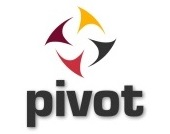

# pivot
一个集设备控制、任务分派、任务调度如一体的、以业务规则为核心的分阶段事件驱动架构（Stage Event Driven Architecture，SEDA ）



## Documentation

- [Documentation Home](https://github.com/edoyun/pivot/wiki)

## Maven

```xml
<dependency>
    <groupId>com.edoyun.pivot</groupId>
    <artifactId>pivot</artifactId>
    <version>x.x.x</version>
</dependency>
```

